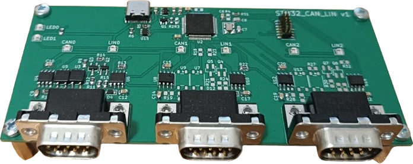

# STM32 Triple CAN/LIN USB bridge
STM32G4xx firmware written in Rust using the Embassy framework that bridges CAN-FD buses to Linux via USB using the `gs_usb` driver and socketCAN interface.

- 3x CAN-FD channels
    - configurable 120Ω termination resistor



## Build & flash & run
Install Rust via [rustup.rs](https://rustup.rs/).

Set `nSWBOOT0` to 0 using STM32CubeProgrammer for the first time, then connect the debugger and flash the device:
```sh
$ cargo run --release
```

Three socketCAN interfaces will appear, for example as `can0`, `can1`, and `can2`.
You can configure them using `ip` command:
```sh
$ sudo ip link set can0 type can bitrate 500000
$ sudo ip link set can0 up
```

After that, you can start sending and receiving CAN frames:
```sh
$ candump can0
$ cansend can0 123#abcd
```

## Configuration
All configurations must be done while the interface is in the `down` state.
```sh
$ sudo ip link set can0 down
```
After the configuration, bring the interface `up`.

### CAN-FD mode and data bitrate
Set CAN to 500 Kbps and CAN-FD to 1 Mbps:
```sh
$ sudo ip link set can0 type can bitrate 500000 fd on dbitrate 1000000
```

### 120Ω termination resistor
Termination resistor can be enabled in configuration mode via:
```sh
$ sudo ip link set can0 down
$ sudo ip link set can0 type can bitrate 500000 termination 120
$ sudo ip link set can0 up
```

### Persistent interface names
Configure udev rules (`/etc/udev/rules.d/91-scan.rules`) for persistent interface names:
```
SUBSYSTEM=="net", ENV{ID_SERIAL}=="trnila_STM32_CAN_LIN_1", ATTR{dev_id}=="0x0", NAME="scan0"
SUBSYSTEM=="net", ENV{ID_SERIAL}=="trnila_STM32_CAN_LIN_1", ATTR{dev_id}=="0x1", NAME="scan1"
SUBSYSTEM=="net", ENV{ID_SERIAL}=="trnila_STM32_CAN_LIN_1", ATTR{dev_id}=="0x2", NAME="scan2"
```
and then reload `sudo udevadm control --reload-rules` and re-plug the device.

## Test
Install following dependencies:
- uv
- [can-utils](https://github.com/linux-can/can-utils)

Next, connect the DUT's `can0` interface to the tester's `can1_0` interface, and so on. Then run:
```sh
$ CAN_IFACES=0:can0:can1_0,1:can1:can1_1,2:can2:can0_0 ./hw_test.py
```
